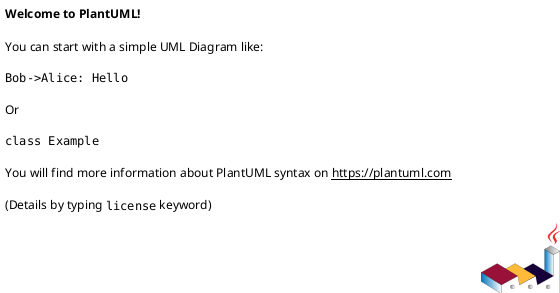

# UML Diagrams

This folder contains UML diagrams for the Supplier Consumer Platform (SCP).

## Directory Structure

```
diagrams/
├── src/           # Source PlantUML files (.uml)
├── out/           # Exported images (PNG, SVG, PDF)
└── README.md      # This file
```

## PlantUML Preview & Rendering

### PlantUML Extension (Recommended)

**Extension:** [PlantUML by jebbs](https://marketplace.visualstudio.com/items?itemName=jebbs.plantuml)

#### Setup:

1. **Install the extension in Cursor/VS Code**
   - Press `Ctrl+P` (or `⌘+P` on Mac)
   - Type: `ext install jebbs.plantuml`
   - Press Enter

2. **Preview your diagram**
   - Open any `.uml` file
   - Press `⌥ + D` (Option + D on Mac) or `Alt + D` (Windows/Linux)
   - Preview updates automatically on save

3. **Export diagrams**
   - Right-click in the diagram preview
   - Select "Export Current Diagram"
   - Choose format (PNG, SVG, PDF)

That's it! The extension comes with everything you need built-in.

### Online PlantUML Editor (Alternative)

If you prefer not to install anything:

1. Visit: https://www.plantuml.com/plantuml/uml/
2. Copy-paste your `.uml` file content
3. View rendered diagram
4. Download as PNG/SVG

## UML Diagram Types in This Project

### Required Diagrams:

1. **Class Diagram** - System classes and relationships
2. **Sequence Diagram** - Object interactions over time
3. **Component Diagram** - System architecture
4. **Activity Diagram** - Business process flows
5. **Use Case Diagram** - User interactions

### Existing Diagrams:

- `src/db-scheme.uml` - Database schema (Entity-Relationship style)

## PlantUML Syntax

### Basic Template:



### Common Elements:

```plantuml
' Class Diagram
class User {
  +username: string
  +login()
}

' Sequence Diagram
Actor -> System: Request
System --> Actor: Response

' Use Case
actor User
User -> (Login)
```

## Tips

- Use `skinparam linetype ortho` for orthogonal (90°) lines
- Add comments with `'` (single line) or `/' ... '/` (multi-line)
- Save source files in `src/` directory
- Export images to `exports/` directory
- Keep diagrams modular and focused (one concern per diagram)

## Resources

- [PlantUML Official Documentation](https://plantuml.com/)
- [Real World PlantUML Examples](https://real-world-plantuml.com/)
- [PlantUML Cheat Sheet](https://ogom.github.io/draw_uml/plantuml/)

## Recommended Workflow

1. Write `.uml` source in `src/` folder
2. Use PlantUML extension with hot reload (⌥ + D)
3. Export final diagrams to `out/` folder
4. Reference exported images in documentation
5. Version control both source and outputs

